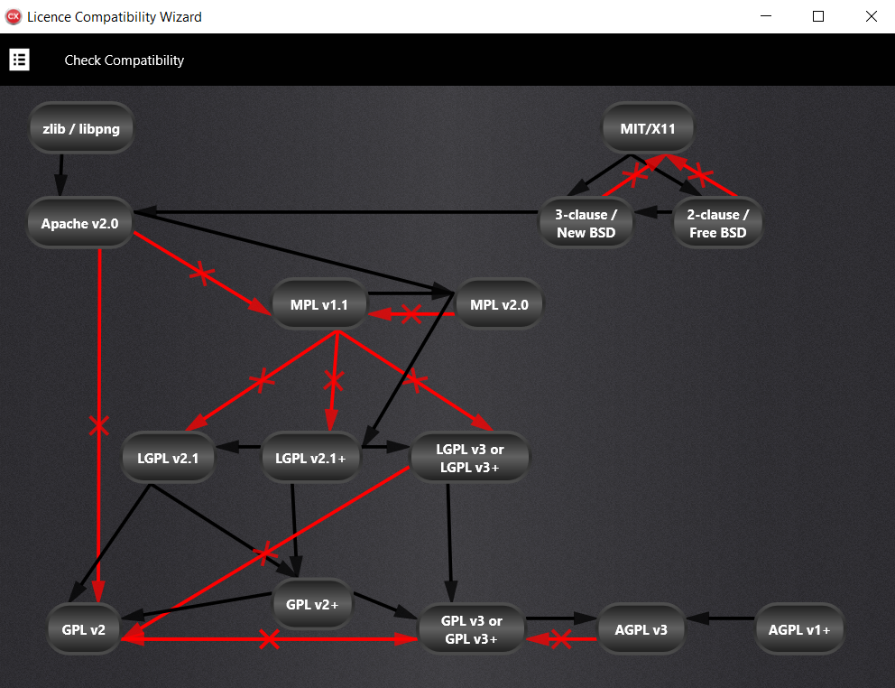

# FOSS License Compatibility Checker

A lightweight, extensible tool for identifying compatibility issues and potential license violations in Free and Open Source Software (FOSS) projects.

> ⚖️ Make informed decisions before combining open-source components.

---
  

## Overview

In today's fast-paced software ecosystem, developers frequently reuse and combine open-source components from multiple sources. While this speeds up innovation, it also introduces a hidden complexity: **license compatibility**.

This tool was created to **automate the detection of license conflicts**, visualize compatibility relationships, and help you make informed decisions when working with FOSS components.

Originally developed as a Master’s thesis project at the University of the Peloponnese, this application bridges the gap between legal theory and developer usability.

---

## Features

- **Automatic Compatibility Checks**  
  Instantly evaluate if combining two or more licenses is legally permissible.

- **Visual License Graph**  
  Explore an interactive, directed graph where nodes represent licenses and edges define compatibility paths.

- **License Selection Wizard**  
  Guides students, researchers, and developers through proper license selection for derivative works.

- **Built-In Knowledge Base**  
  Includes compatibility data and official texts for 20+ of the most commonly used licenses (GPL, MIT, Apache, BSD, Mozilla, etc.).

- **Cross-Platform and User-Friendly**  
  Built with Embarcadero C++ Builder and designed for simplicity and clarity.

- **Extensible and Maintainable**  
  Structured for easy updates and the inclusion of new licenses or rules as the ecosystem evolves.

---

## Why This Project?

Combining open-source components can be risky. Incompatibilities between licenses may:
- Restrict how your software can be distributed
- Force the disclosure of proprietary code
- Invalidate entire codebases in commercial contexts

This project aims to **demystify the legal barriers** and support **responsible, confident reuse** of open-source code.

---

## Installation

> ⚠️ Coming soon: installers and binaries for Windows, macOS, and Linux.

For now, clone the repo and build using Embarcadero C++ Builder (instructions in `INSTALL.md`).

---

## Usage

Once launched:
1. Select licenses to compare.
2. View their compatibility status in the UI.
3. Explore the compatibility graph to discover legal paths for reuse.
4. Optionally add your own licenses or modify the graph for custom workflows.

---

## Architecture

- Core data model: `Directed Graph`
- License definitions: parsed from `.ini` files and license text corpus
- Compatibility logic: recursive search for legal paths
- UI: Wizard-style interface with modular editor, viewer, and validator

---

## Example Use Cases

- **Developers** merging code from different GitHub projects
- **Researchers** combining open datasets under various licenses
- **Organizations** validating compliance in distributed software
- **Educators** introducing FOSS licensing concepts

---

## License

This repository is licensed under the [MIT License](LICENSE). Note: the tool evaluates licenses from OSI-approved sources, but does **not** constitute legal advice.

---

## Roadmap

- [ ] SPDX metadata support
- [ ] JSON-based license schema import/export
- [ ] CLI version for CI pipelines
- [ ] Online version for in-browser checks

---

## Acknowledgments

Developed by **Anastasios Benos**  
Supervised by **Prof. Nikolaos Tselikas**  
University of the Peloponnese – MSc in Modern Wireless Communications

This project is inspired by the spirit of open-source collaboration and the need for practical tools that bridge technical and legal domains.

---

## Contributing

Pull requests are welcome! Whether it's improving compatibility rules, refining the UI, or translating the tool for global audiences—every contribution helps.

---

## Related Links

- [Open Source Initiative](https://opensource.org/)
- [Free Software Foundation](https://www.fsf.org/)
- [Black Duck License Usage Data](https://www.synopsys.com/software-integrity/security-testing/software-composition-analysis.html)

